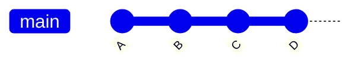
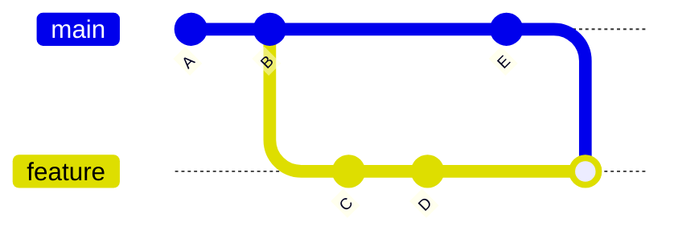
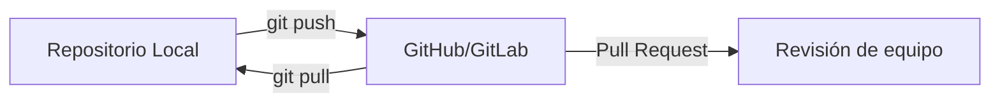
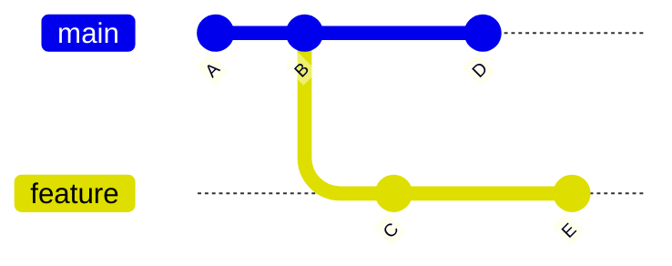
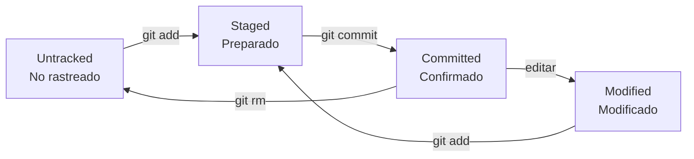

# 📦 Fundamentos de Git

---

## 🧠 ¿Qué es Git?

Git es un **sistema de control de versiones distribuido** que permite:
- Rastrear cambios en el código
- Trabajar en paralelo sin sobrescribir el trabajo de otros
- Volver a versiones anteriores si algo falla

Git no guarda "archivos", sino **instantáneas del estado completo del proyecto** en cada commit.

---

## 🔑 Conceptos fundamentales

### 1. **Working Copy (Área de trabajo)**
- Es tu **carpeta de proyecto local**
- Aquí editas archivos libremente
- Los cambios **no están rastreados** hasta que los agregas al *staging area*

### 2. **Staging Index (Área de preparación)**
- Área intermedia donde **seleccionas qué cambios incluir en el próximo commit**
- Comando: `git add <archivo>`
- Permite hacer commits **parciales y significativos**

### 3. **Commit Objects (Objetos de confirmación)**
- Cada `git commit` crea un **objeto inmutable** con:
  - Un **snapshot** del proyecto en ese momento
  - Un **mensaje descriptivo**
  - Una **referencia al commit padre** (excepto el inicial)
- Los commits forman una **cadena cronológica** (historial)

### 4. **Remotes (Remotos)**
- Copias del repositorio en servidores (ej. GitHub, GitLab)
- El remoto por defecto se llama `origin`
- Comandos clave:  
  - `git clone <url>` → copia el repositorio remoto  
  - `git push` → envía commits locales al remoto  
  - `git pull` → trae cambios del remoto

---

## 📈 Flujo básico de trabajo

```mermaid
flowchart LR
    A[Working Copy\n(editar archivos)] -->|git add| B[Staging Index\n(preparar cambios)]
    B -->|git commit| C[Commit History\n(guardar instantánea)]
    C -->|git push| D[Remote\n(GitHub/GitLab)]
```

> ✅ Este flujo refuerza **4.02**: comandos básicos (`add`, `commit`, `push`)

---

## 🔗 Estructura de los commits

Cada commit apunta a su padre, formando una **lista enlazada**:



- El commit `D` conoce a `C`, `C` a `B`, y así sucesivamente.
- Esto permite **viajar en el tiempo** a cualquier versión.

---

## 🔄 Flujos comunes: `merge` vs `rebase`

### 1. **Merge: combinar historias sin reescribir**

Ideal para **preservar el historial exacto** del equipo.



- Crea un **commit de merge** (nodo con dos padres)
- Muestra claramente que hubo trabajo paralelo

> 📌 Comando:  
> ```bash
> git checkout main
> git merge feature
> ```

---

### 2. **Rebase: reescribir el historial para linealidad**

Ideal para **mantener un historial limpio** antes de integrar a `main`.


- **Reaplica** los commits de la rama sobre la punta de `main`
- El historial queda **lineal**, como si el trabajo se hubiera hecho secuencialmente

> ⚠️ **Nunca uses `rebase` en commits ya compartidos en el remoto**  
> 📌 Comando:  
> ```bash
> git checkout feature
> git rebase main
> ```

---

## 📤 Flujo con remoto (colaboración)



---

## 🧪 Comandos esenciales

| Acción | Comando |
|-------|--------|
| Iniciar repositorio | `git init` |
| Clonar repositorio | `git clone <url>` |
| Ver estado | `git status` |
| Preparar cambios | `git add .` |
| Confirmar | `git commit -m "mensaje"` |
| Enviar al remoto | `git push origin main` |
| Traer cambios | `git pull origin main` |
| Crear rama | `git checkout -b nombre-rama` |
| Fusionar | `git merge nombre-rama` |
| Rebasar | `git rebase main` |

---

## 🌳 Ramas (Branches): Trabajo en paralelo

### ¿Qué es una rama?

Una rama es simplemente un **puntero movible** a un commit específico. Permite desarrollar funcionalidades, corregir bugs o experimentar sin afectar el código principal.



### Ventajas de usar ramas

- ✅ **Aislamiento**: Trabaja en nuevas funcionalidades sin romper el código estable
- ✅ **Experimentación**: Prueba ideas sin miedo a afectar `main`
- ✅ **Colaboración**: Múltiples personas pueden trabajar en paralelo
- ✅ **Organización**: Separa funcionalidades, bugs y experimentos

### Comandos de ramas

```bash
# Crear nueva rama
git branch nombre-rama

# Cambiar a una rama
git checkout nombre-rama

# Crear y cambiar (atajo)
git checkout -b nombre-rama

# Ver todas las ramas
git branch -a

# Eliminar rama local
git branch -d nombre-rama

# Eliminar rama remota
git push origin --delete nombre-rama
```

---

## 🎯 HEAD: Tu posición actual

`HEAD` es un **puntero especial** que indica dónde estás ubicado en el historial de Git.

### Estados de HEAD

1. **HEAD apuntando a una rama** (lo normal):
   ```
   HEAD → main → commit C
   ```
   Cuando haces un commit, la rama se mueve automáticamente.

2. **Detached HEAD** (modo de inspección):
   ```
   HEAD → commit B
   ```
   Estás viendo un commit antiguo directamente. Los commits nuevos se perderán si no creas una rama.

### Comandos útiles con HEAD

```bash
# Ver último commit
git show HEAD

# Ver commit anterior
git show HEAD~1

# Ver 3 commits atrás
git show HEAD~3

# Volver atrás (sin perder cambios)
git reset --soft HEAD~1

# Volver atrás (borrando cambios)
git reset --hard HEAD~1
```

---

## 🔍 Estados de los archivos en Git

Git clasifica los archivos en diferentes estados:



### 1. **Untracked (No rastreado)**
- Archivo nuevo que Git aún no conoce
- No aparece en el historial
- Se muestra en rojo en `git status`

### 2. **Staged (Preparado)**
- Cambios marcados para incluir en el próximo commit
- Se muestra en verde en `git status`
- Comando: `git add <archivo>`

### 3. **Modified (Modificado)**
- Archivo rastreado que fue editado
- Los cambios no están preparados aún
- Se muestra en rojo en `git status`

### 4. **Committed (Confirmado)**
- Cambios guardados permanentemente en el historial
- Forman parte de un snapshot inmutable

---

## ↩️ Deshaciendo cambios

### Descartar cambios en Working Directory

```bash
# Descartar cambios de UN archivo
git checkout -- archivo.txt

# Descartar TODOS los cambios no preparados
git checkout -- .

# Alternativa moderna (Git 2.23+)
git restore archivo.txt
```

### Quitar archivos del Staging Area

```bash
# Sacar archivo del staging (mantener cambios)
git reset HEAD archivo.txt

# Alternativa moderna
git restore --staged archivo.txt
```

### Deshacer el último commit

```bash
# Mantener los cambios en working directory
git reset --soft HEAD~1

# Mantener cambios pero sacarlos del staging
git reset --mixed HEAD~1

# BORRAR completamente los cambios ⚠️
git reset --hard HEAD~1
```

### Revertir un commit (crear commit inverso)

```bash
# Crear un nuevo commit que deshace los cambios
git revert <hash-del-commit>
```

> **Diferencia clave**: `reset` reescribe el historial, `revert` crea un nuevo commit.

---

## 🔀 Resolución de conflictos

### ¿Cuándo ocurren?

Los conflictos suceden cuando:
- Dos ramas modifican **las mismas líneas** de un archivo
- Git no puede decidir automáticamente qué cambio mantener

### Flujo para resolver conflictos

```bash
# 1. Intentar merge
git merge feature

# 2. Git reporta conflicto
# CONFLICT (content): Merge conflict in archivo.js

# 3. Abrir el archivo, verás marcas:
# <<<<<<< HEAD
#   código de la rama actual
# =======
#   código de la otra rama
# >>>>>>> feature

# 4. Editar el archivo manualmente, elegir qué mantener

# 5. Marcar como resuelto
git add archivo.js

# 6. Completar el merge
git commit -m "Resuelve conflicto en archivo.js"
```

### Herramientas para ayudar

```bash
# Ver qué archivos tienen conflictos
git status

# Usar herramienta gráfica
git mergetool

# Abortar el merge
git merge --abort
```

---

## 🏷️ Tags: Marcando versiones

Los tags son **referencias permanentes** a commits específicos, ideales para marcar versiones de lanzamiento.

### Tipos de tags

1. **Lightweight (ligero)**:
   ```bash
   git tag v1.0.0
   ```

2. **Annotated (anotado)** - recomendado:
   ```bash
   git tag -a v1.0.0 -m "Primera versión estable"
   ```

### Comandos de tags

```bash
# Ver todos los tags
git tag

# Ver información de un tag
git show v1.0.0

# Crear tag en commit específico
git tag -a v1.0.0 <hash-commit> -m "mensaje"

# Enviar tags al remoto
git push origin v1.0.0

# Enviar todos los tags
git push origin --tags

# Eliminar tag local
git tag -d v1.0.0

# Eliminar tag remoto
git push origin --delete v1.0.0
```

---

## 📜 Historial y búsqueda

### Ver el historial

```bash
# Historial completo
git log

# Historial compacto (una línea por commit)
git log --oneline

# Con gráfico de ramas
git log --oneline --graph --all

# Últimos N commits
git log -5

# Historial de un archivo
git log -- archivo.txt

# Ver cambios en cada commit
git log -p
```

### Buscar en el historial

```bash
# Buscar commits por mensaje
git log --grep="bug fix"

# Buscar commits por autor
git log --author="Juan"

# Buscar commits en un rango de fechas
git log --since="2024-01-01" --until="2024-12-31"

# Buscar cuándo se modificó una línea
git blame archivo.txt

# Buscar texto en el contenido
git log -S"función importante"
```

---

## 🔄 Stash: Guardar trabajo temporal

`git stash` guarda cambios temporalmente sin hacer commit, útil cuando necesitas cambiar de rama pero no quieres commitear trabajo a medio hacer.

### Comandos de stash

```bash
# Guardar cambios actuales
git stash

# Guardar con mensaje descriptivo
git stash save "WIP: nueva funcionalidad"

# Ver lista de stashes
git stash list

# Aplicar último stash (mantenerlo)
git stash apply

# Aplicar y eliminar último stash
git stash pop

# Aplicar stash específico
git stash apply stash@{2}

# Eliminar stash
git stash drop stash@{0}

# Eliminar todos los stashes
git stash clear

# Ver contenido de un stash
git stash show -p stash@{0}
```

---

## 🔐 .gitignore: Ignorando archivos

El archivo `.gitignore` especifica qué archivos/carpetas NO deben rastrearse.

### Ejemplo de .gitignore

```gitignore
# Dependencias
node_modules/
vendor/

# Archivos de entorno
.env
.env.local

# Archivos de sistema
.DS_Store
Thumbs.db

# Logs
*.log
logs/

# Archivos compilados
*.class
*.o
dist/
build/

# IDEs
.vscode/
.idea/
*.swp
```

### Reglas importantes

- `#` para comentarios
- `*` para cualquier secuencia de caracteres
- `**` para cualquier número de directorios
- `!` para negar una regla (incluir archivo)

```gitignore
# Ignorar todos los .txt
*.txt

# Excepto README.txt
!README.txt

# Ignorar carpeta temp en cualquier nivel
**/temp
```

---

## 🌐 Trabajando con remotos

### Configurar remotos

```bash
# Ver remotos configurados
git remote -v

# Agregar remoto
git remote add origin https://github.com/usuario/repo.git

# Cambiar URL del remoto
git remote set-url origin nueva-url

# Eliminar remoto
git remote remove origin

# Renombrar remoto
git remote rename origin upstream
```

### Sincronización

```bash
# Traer cambios (fetch + merge)
git pull origin main

# Solo traer referencias (sin merge)
git fetch origin

# Ver ramas remotas
git branch -r

# Enviar rama local al remoto
git push -u origin nombre-rama

# Forzar push (⚠️ peligroso)
git push --force origin main
```

---

## 🔄 Cherry-pick: Aplicar commits específicos

`cherry-pick` permite aplicar un commit específico de una rama a otra.

```bash
# Aplicar un commit específico
git cherry-pick <hash-commit>

# Aplicar múltiples commits
git cherry-pick <hash1> <hash2> <hash3>

# Aplicar un rango de commits
git cherry-pick <hash-inicial>^..<hash-final>
```

**Caso de uso**: Necesitas un bug fix específico de otra rama sin traer todos los cambios.

---

## 🎓 Mejores prácticas

### Commits

✅ **Hacer**:
- Commits pequeños y enfocados
- Mensajes descriptivos en imperativo: "Agrega función" (no "Agregué")
- Un commit por cambio lógico
- Commitear a menudo

❌ **Evitar**:
- Commits gigantes con múltiples cambios
- Mensajes vagos: "fix", "cambios", "wip"
- Commitear código roto
- Archivos generados automáticamente

### Ramas

✅ **Hacer**:
- Nombres descriptivos: `feature/login`, `bugfix/typo-header`
- Una rama por funcionalidad
- Mantener ramas actualizadas con `main`
- Eliminar ramas después de fusionar

❌ **Evitar**:
- Ramas de larga duración
- Nombres ambiguos: `test`, `temp`, `nueva`
- Muchas funcionalidades en una rama

### Flujo de trabajo

1. **Actualizar**: `git pull origin main`
2. **Crear rama**: `git checkout -b feature/nueva-funcionalidad`
3. **Desarrollar**: Hacer cambios y commits
4. **Actualizar rama**: `git pull origin main` (resolver conflictos)
5. **Push**: `git push origin feature/nueva-funcionalidad`
6. **Pull Request**: Revisar y aprobar
7. **Merge**: Integrar a `main`
8. **Limpiar**: Eliminar rama

---

## 📚 Recursos adicionales

### Documentación oficial
- [Git Documentation](https://git-scm.com/doc)
- [Pro Git Book](https://git-scm.com/book/es/v2)

### Aprendizaje interactivo
- [Learn Git Branching](https://learngitbranching.js.org/)
- [Git Playground](https://git-school.github.io/visualizing-git/)

### Herramientas
- [GitKraken](https://www.gitkraken.com/) - Cliente gráfico
- [Sourcetree](https://www.sourcetreeapp.com/) - Cliente gráfico
- [GitHub Desktop](https://desktop.github.com/) - Cliente oficial de GitHub

---

## 🆘 Comandos de emergencia

### "¡Hice commit en la rama equivocada!"

```bash
# Copiar el hash del último commit
git log --oneline

# Cambiar a la rama correcta
git checkout rama-correcta

# Aplicar el commit
git cherry-pick <hash>

# Volver a la rama incorrecta
git checkout rama-incorrecta

# Eliminar el commit erróneo
git reset --hard HEAD~1
```

### "¡Necesito recuperar algo que borré!"

```bash
# Ver historial completo (incluso commits eliminados)
git reflog

# Restaurar a un commit específico
git checkout <hash>

# O crear rama desde ahí
git checkout -b recuperacion <hash>
```

### "¡Arruiné todo, quiero empezar de nuevo!"

```bash
# Descartar TODOS los cambios locales
git reset --hard HEAD

# Descartar cambios Y volver al estado del remoto
git fetch origin
git reset --hard origin/main
```

---

## 🎯 Resumen de conceptos clave

| Concepto | Descripción |
|----------|-------------|
| **Repository** | Contenedor del proyecto y su historial completo |
| **Commit** | Snapshot inmutable del estado del proyecto |
| **Branch** | Puntero móvil a un commit (permite trabajo paralelo) |
| **HEAD** | Puntero a tu posición actual en el historial |
| **Staging Area** | Zona intermedia donde preparas cambios |
| **Working Directory** | Tu carpeta de trabajo local |
| **Remote** | Versión del repositorio en servidor (GitHub, GitLab) |
| **Merge** | Combinar dos ramas manteniendo historia |
| **Rebase** | Replicar commits para historia lineal |
| **Tag** | Marca permanente a un commit (versiones) |
| **Stash** | Almacén temporal de cambios sin commit |

---

**¡Felicidades!** 🎉 Ahora tienes una comprensión sólida de los fundamentos de Git. La práctica constante te ayudará a dominar estas herramientas.
