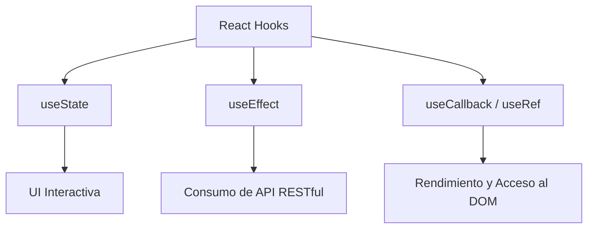

# Introducción a los React Hooks  

---

## ¿Qué son los React Hooks?

Los **Hooks** son funciones especiales que permiten a los **componentes funcionales de React** usar características que antes solo estaban disponibles en componentes de clase, como:

- **Estado** (`useState`)
- **Efectos secundarios** (`useEffect`)
- **Memorización** (`useCallback`, `useMemo`)
- **Referencias al DOM** (`useRef`)

Fueron introducidos en React 16.8 (2019) y hoy son el **estándar de desarrollo** en el ecosistema React.

---

## Hooks esenciales para este curso

### 1. `useState` – Estado local
Permite que un componente **recuerde información** entre renderizados.

```jsx
const [valor, setValor] = useState(0);
```

---

### 2. `useEffect` – Efectos secundarios
Ejecuta código **después de que React actualiza el DOM**. Ideal para:
- Cargar datos de una API (**2.04**)
- Suscribirse a eventos
- Actualizar el título de la página

```jsx
useEffect(() => {
  fetch('/api/datos').then(...);
}, []); // ← Solo al montar
```

---

### 3. `useCallback` – Optimización de funciones
Evita recrear funciones innecesariamente, mejorando el rendimiento en componentes hijos.

```jsx
const manejarClick = useCallback(() => { ... }, []);
```

> **Relación con RA3 (Alto)**: Aplicación eficiente de frameworks en aplicaciones reales

---

### 4. `useRef` – Acceso al DOM
Permite guardar una referencia mutable (no provoca re-render).

```jsx
const inputRef = useRef(null);
// inputRef.current.focus();
```

> Útil para formularios, animaciones, etc.

---

## ¿Por qué no usar variables normales?

```jsx
function Contador() {
  let contador = 0; // ❌ No es estado reactivo
  return <button onClick={() => contador++}>Contador: {contador}</button>;
}
```

→ Al hacer clic, `contador` **sí cambia**, pero **React no lo sabe**, así que **la UI no se actualiza**.

Con `useState`, React **detecta el cambio** y **vuelve a renderizar** el componente.

---

## Diagrama: ¿Por qué los Hooks son clave en este curso?

El siguiente diagrama de Mermaid ilustra cómo los Hooks conectan los **contenidos del programa** con las **capacidades del estudiante**:



> **Interpretación**:  
> Los Hooks no son solo sintaxis: son el **puente** entre los **fundamentos web** (RA1) y la **implementación de soluciones reales** (RA2–RA3), culminando en un **proyecto full-stack** que integra frontend, backend y control de versiones.

---
